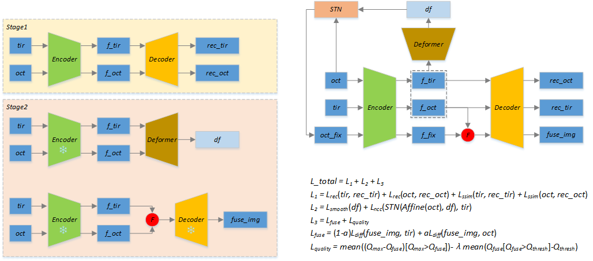

# CycleFusion

## Requirements

- python==3.8
- torch==2.1.2+cu11.8
- torchvision==0.16.2+cu11.8
- opencv-python
- scipy
- timm
- einops

## Updates

- **2024/4/21**: 创建项目
- **2024/4/25**: 更新data_process.py, 添加测试程序
- **2024/5/23**: 添加质量分数评估接口和测试程序, 完成main.py调试
- **2024/6/17**: 完成main_score.py调试
- **2024/7/16**: 调整data_process.py和quality.py

## Overview

Figure 1: Train strategy(left), Framework(right top) and losses(right bottom).

## Experimental record
| Date | configs | losses | questions |
| --- | --- | --- | --- |
| 2024-07-19 09:40:14 | batch_size=2, critic=2, data_dir='images/dataset2', epochs=200, fuse_weight=0.7, image_size=256, is_train=True, lr=0.0001, output_dir='output/20240719_094014', patience=5, pretrain_weight='output/models/aaa', quality_thresh=0.5, regular_factor=0.1, save_interval=5, seed=40, ssim_weight=1.0, test_num=20 | quality: mse ssim: ssim pixel: mse fusion: mse | 1. 质量分数损失相较于其他损失下降的最慢; 2. 质量分数预测图过于平滑, 指纹中质量较差部分未表现出来; 3. 在迭代一定epoch后, 融合图像的背景由黑色变为了灰色